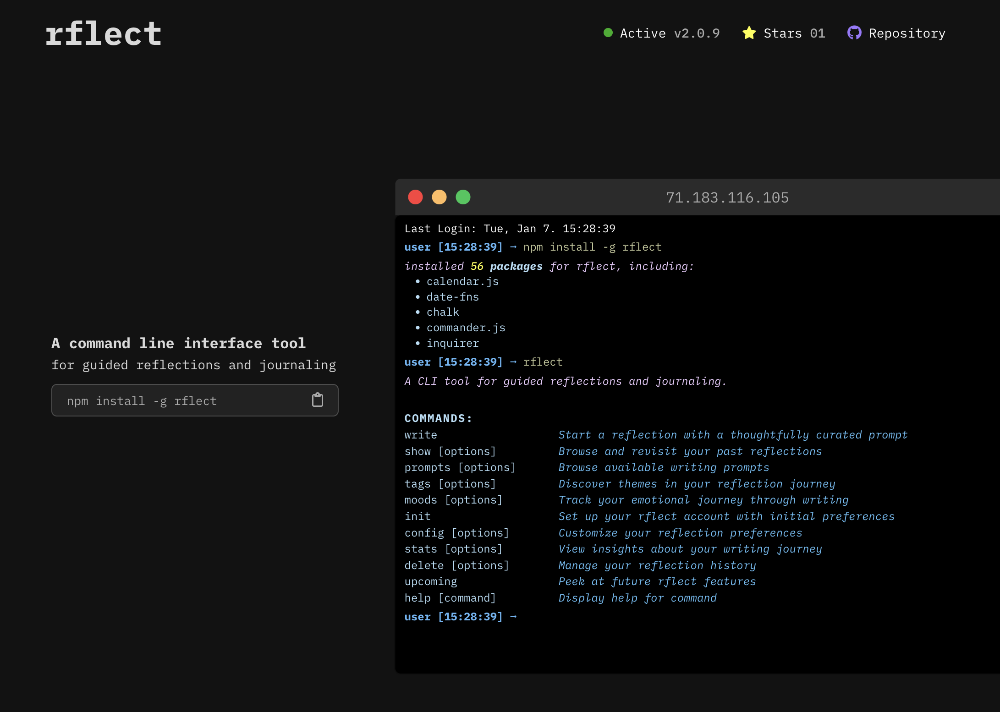

# rflect

📝 Landing page for a CLI tool focused on providing guided reflections and journaling.

**Links: [NPM Package](https://www.npmjs.com/package/rflect) | [CLI Repository](https://github.com/aniqatc/rflect-cli) | [Landing Page](https://rflect.aniqa.dev)**

## Tech

- React
- Vite
- Sass
- Framer Motion

## Libraries & Integrations

- Date-fns for date/time formatting
- Font Awesome for icons
- GitHub API for repository star count
- NPM API for current version
- Ipify API to display visitor's address

## Features

### Dynamic Terminal Simulation

- Provides an interactive, scroll-based demonstration of the CLI tool
- Each feature is presented as a live terminal session
- Content appears dynamically as users scroll, mimicking a real terminal experience
- Showcases:
  - Installation process
  - Available commands
  - Sample outputs
  - User interactions

### Key Interactive Elements

- **Scroll-Triggered Content**: Terminal outputs reveal themselves as users scroll
- **Live GitHub Star Counter**: Real-time display of repository stars
- **Live NPM Version**: Real-time display of the current version code for the package
- **Interactive Command Buttons**: One-click copy functionality for each feature's command

## Key Concepts

- Uses Framer Motion for smooth scroll animations
- Uses React state and useEffect for dynamic content rendering
- Integrates with GitHub API for live star count
- Implements clipboard API for one-click command copying

## CLI Capabilities

For more details on the CLI tool itself, visit the [dedicated repository for rflect-cli](https://github.com/aniqatc/rflect-cli).

- Guided writing prompts
- Mood tracking
- Writing stats and insights
- Customizable account settings

## Project Structure

- `components/`: holds all components files, each has its own `index.js` for barrel exports
- `data/`: holds the details relating to each feature (title, description, command, output, metadata, etc)
- `styles/`: holds SCSS partials for each component, global variables file for a consistent theme, and main.scss file

## Available Scripts

Built with [Vite](https://vite.dev/). Available scripts include:

- `npm start`: Start development server
- `npm run build`: Create production build
- `npm run preview`: Preview production build
- `npm run lint`: Run ESLint
- `npm run format`: Format code with Prettier
